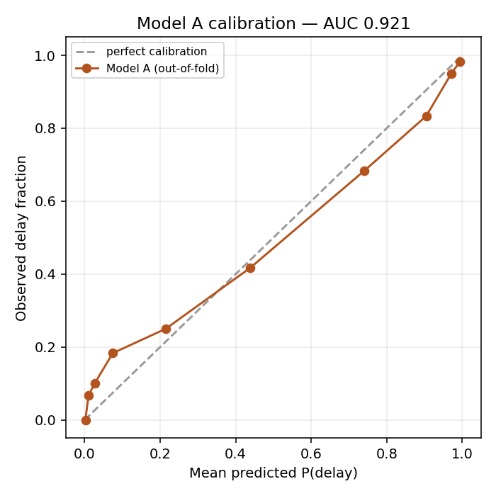

# Model report card — v2026-08-23T12-16-56

**Run date 2026-08-23 12:16:56** · 5-fold stratified cross-validation, all figures
out-of-fold. Training data is **synthetic** (`ml/src/data/generate_dataset.py`, rev 3) —
no public land-acquisition delay-risk dataset exists in India, and that absence is the
novelty argument, not a defect.

## Model A — binary `is_delayed` (600 closed projects)

| Metric | Value |
|---|---|
| **ROC AUC** | **0.9212** |
| Accuracy | 0.8567 |
| F1 (delayed) | 0.8352 |
| Brier score | 0.113 |
| Positive rate | 0.4467 |
| n | 600 |

**Exit criterion AUC ≥ 0.85 — PASS.**

### Confusion matrix (threshold 0.50)

|  | predicted on-time | predicted delayed |
|---|---|---|
| **actual on-time** | 296 | 36 |
| **actual delayed** | 50 | 218 |

### Calibration

| mean predicted | observed fraction |
|---|---|
| 0.002 | 0.0 |
| 0.0102 | 0.0667 |
| 0.0264 | 0.1 |
| 0.0746 | 0.1833 |
| 0.2148 | 0.25 |
| 0.438 | 0.4167 |
| 0.7406 | 0.6833 |
| 0.9046 | 0.8333 |
| 0.9712 | 0.95 |
| 0.9945 | 0.9833 |

Probabilities served to officers are isotonic-calibrated on these out-of-fold predictions,
so "0.72" on the dashboard means roughly 72 of 100 comparable files slipped.

### Per-state slice

| state | n | positives | AUC | accuracy |
|---|---|---|---|---|
| Chhattisgarh | 93 | 48 | 0.9398 | 0.8602 |
| Karnataka | 76 | 37 | 0.8891 | 0.8289 |
| Madhya Pradesh | 63 | 28 | 0.8898 | 0.8095 |
| Maharashtra | 81 | 40 | 0.9201 | 0.8642 |
| Odisha | 66 | 24 | 0.9395 | 0.8788 |
| Tamil Nadu | 73 | 27 | 0.9195 | 0.8767 |
| Telangana | 80 | 35 | 0.9041 | 0.85 |
| Uttar Pradesh | 68 | 29 | 0.9558 | 0.8824 |

### Top gain importance

| feature | gain share |
|---|---|
| no_legal_disputes | 0.1377 |
| title_clarity_status | 0.0742 |
| legal_dispute_stage | 0.0523 |
| no_ownership_disputes | 0.0466 |
| compensation_disbursed_pct | 0.0461 |
| compensation_gap_pct | 0.039 |
| days_since_dispute_filed | 0.0353 |
| rehab_progress_pct | 0.0344 |
| rehab_plan_approved_flag | 0.0307 |
| forest_clearance_status | 0.0301 |
| no_compensation_appeals | 0.0274 |
| court_stay_flag | 0.0263 |
| state_Chhattisgarh | 0.0245 |
| ownership_dispute_flag | 0.0241 |
| approval_stage | 0.0233 |

## Model B — 5-class `delay_stage` (delayed closed projects only)

| Metric | Value |
|---|---|
| **Accuracy** | **0.7127** |
| Majority baseline | 0.347 |
| **Ratio to baseline** | **2.0538×** |
| Top-2 accuracy | 0.9328 |
| Macro F1 | 0.6709 |
| n | 268 |

**Exit criterion accuracy ≥ 2× majority baseline — PASS.**

### Class support

| class | n |
|---|---|
| Compensation Disbursal | 54 |
| Legal Dispute | 93 |
| Rehabilitation (R&R) | 26 |
| Ownership / Title | 59 |
| Administrative Approval | 36 |

### Confusion matrix (rows actual, columns predicted)

|  | Compensation Disbursal | Legal Dispute | Rehabilitation (R&R) | Ownership / Title | Administrative Approval |
|---|---|---|---|---|---|
| Compensation Disbursal | 31 | 12 | 3 | 2 | 6 |
| Legal Dispute | 6 | 77 | 3 | 6 | 1 |
| Rehabilitation (R&R) | 1 | 7 | 14 | 3 | 1 |
| Ownership / Title | 0 | 6 | 2 | 51 | 0 |
| Administrative Approval | 10 | 5 | 2 | 1 | 18 |

### Per-state slice

| state | n | accuracy |
|---|---|---|
| Chhattisgarh | 48 | 0.6458 |
| Karnataka | 37 | 0.7838 |
| Madhya Pradesh | 28 | 0.6786 |
| Maharashtra | 40 | 0.675 |
| Odisha | 24 | 0.7083 |
| Tamil Nadu | 27 | 0.8519 |
| Telangana | 35 | 0.6857 |
| Uttar Pradesh | 29 | 0.7241 |

### Top gain importance

| feature | gain share |
|---|---|
| title_clarity_status | 0.084 |
| compensation_dispute_flag | 0.0749 |
| no_ownership_disputes | 0.0395 |
| district_Nagpur | 0.0387 |
| no_legal_disputes | 0.0378 |
| state_Tamil Nadu | 0.0354 |
| rehab_progress_pct | 0.0264 |
| legal_dispute_stage | 0.0249 |
| state_Karnataka | 0.0244 |
| no_pending_clearances | 0.0241 |
| ownership_dispute_flag | 0.0241 |
| court_stay_flag | 0.0233 |
| project_type_Urban Metro | 0.0209 |
| days_in_current_stage | 0.0207 |
| compensation_gap_pct | 0.0207 |

## Honest limits

- Both models are trained on 600 synthetic closed projects. Correlations are injected by
  design and grounded in LARR Act 2013 parameters, not observed from field data.
- Model B is conditional on delay and its weakest class is the smallest — read the
  confusion matrix before quoting a single accuracy number.
- Succession risk is a deterministic rule and is **never** a model input.
