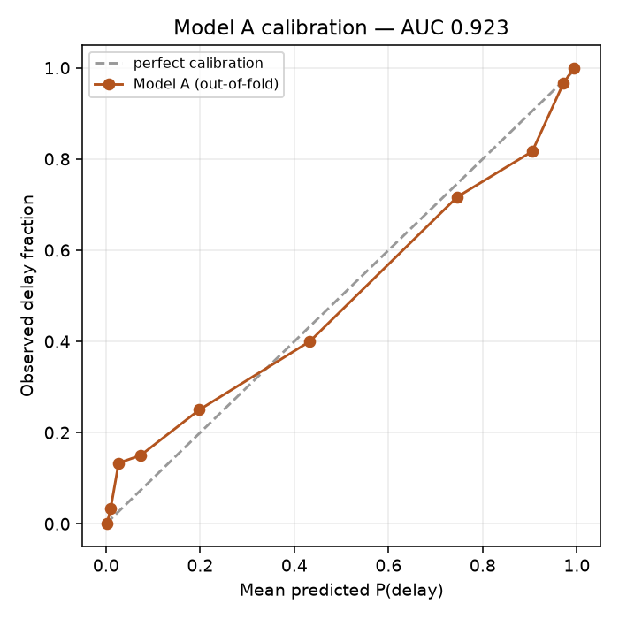

# Model report card — v2026-08-23T20-18-26

**Run date 2026-08-23 20:18:26** · 5-fold stratified cross-validation, all figures
out-of-fold. Training data is **synthetic** (`ml/src/data/generate_dataset.py`, rev 3) —
no public land-acquisition delay-risk dataset exists in India, and that absence is the
novelty argument, not a defect.

## Model A — binary `is_delayed` (600 closed projects)

| Metric | Value |
|---|---|
| **ROC AUC** | **0.9228** |
| Accuracy | 0.85 |
| F1 (delayed) | 0.8282 |
| Brier score | 0.1124 |
| Positive rate | 0.4467 |
| n | 600 |

**Exit criterion AUC ≥ 0.85 — PASS.**

### Confusion matrix (threshold 0.50)

|  | predicted on-time | predicted delayed |
|---|---|---|
| **actual on-time** | 293 | 39 |
| **actual delayed** | 51 | 217 |

### Calibration

| mean predicted | observed fraction |
|---|---|
| 0.0021 | 0.0 |
| 0.0098 | 0.0333 |
| 0.0269 | 0.1333 |
| 0.0734 | 0.15 |
| 0.1982 | 0.25 |
| 0.4328 | 0.4 |
| 0.7458 | 0.7167 |
| 0.9053 | 0.8167 |
| 0.9716 | 0.9667 |
| 0.9945 | 1.0 |

Probabilities served to officers are isotonic-calibrated on these out-of-fold predictions,
so "0.72" on the dashboard means roughly 72 of 100 comparable files slipped.

### Per-state slice

| state | n | positives | AUC | accuracy |
|---|---|---|---|---|
| Chhattisgarh | 93 | 48 | 0.9444 | 0.8817 |
| Karnataka | 76 | 37 | 0.887 | 0.8289 |
| Madhya Pradesh | 63 | 28 | 0.8796 | 0.7619 |
| Maharashtra | 81 | 40 | 0.9299 | 0.8642 |
| Odisha | 66 | 24 | 0.9355 | 0.8939 |
| Tamil Nadu | 73 | 27 | 0.9219 | 0.8493 |
| Telangana | 80 | 35 | 0.906 | 0.8125 |
| Uttar Pradesh | 68 | 29 | 0.9549 | 0.8971 |

### Top gain importance

| feature | gain share |
|---|---|
| no_legal_disputes | 0.1213 |
| title_clarity_status | 0.0816 |
| legal_dispute_stage | 0.0531 |
| compensation_disbursed_pct | 0.0423 |
| no_ownership_disputes | 0.0379 |
| state_Tamil Nadu | 0.0375 |
| compensation_gap_pct | 0.0355 |
| rehab_progress_pct | 0.0315 |
| no_compensation_appeals | 0.0289 |
| forest_clearance_status | 0.0253 |
| project_type_Irrigation Canal | 0.0243 |
| environmental_clearance_status | 0.0222 |
| court_stay_flag | 0.0221 |
| project_type_Railway Line | 0.0217 |
| days_since_dispute_filed | 0.0214 |

## Model B — 5-class `delay_stage` (delayed closed projects only)

| Metric | Value |
|---|---|
| **Accuracy** | **0.6978** |
| Majority baseline | 0.347 |
| **Ratio to baseline** | **2.0108×** |
| Top-2 accuracy | 0.9328 |
| Macro F1 | 0.6603 |
| n | 268 |

**Exit criterion accuracy ≥ 2× majority baseline — PASS.**

### Class support

| class | n |
|---|---|
| Compensation Disbursal | 54 |
| Legal Dispute | 93 |
| Rehabilitation (R&R) | 26 |
| Ownership / Title | 59 |
| Administrative Approval | 36 |

### Confusion matrix (rows actual, columns predicted)

|  | Compensation Disbursal | Legal Dispute | Rehabilitation (R&R) | Ownership / Title | Administrative Approval |
|---|---|---|---|---|---|
| Compensation Disbursal | 31 | 12 | 3 | 2 | 6 |
| Legal Dispute | 7 | 73 | 3 | 9 | 1 |
| Rehabilitation (R&R) | 2 | 6 | 14 | 3 | 1 |
| Ownership / Title | 0 | 6 | 2 | 51 | 0 |
| Administrative Approval | 10 | 5 | 2 | 1 | 18 |

### Per-state slice

| state | n | accuracy |
|---|---|---|
| Chhattisgarh | 48 | 0.6458 |
| Karnataka | 37 | 0.7838 |
| Madhya Pradesh | 28 | 0.6786 |
| Maharashtra | 40 | 0.6 |
| Odisha | 24 | 0.7083 |
| Tamil Nadu | 27 | 0.8519 |
| Telangana | 35 | 0.6571 |
| Uttar Pradesh | 29 | 0.7241 |

### Top gain importance

| feature | gain share |
|---|---|
| title_clarity_status | 0.0977 |
| no_legal_disputes | 0.0365 |
| state_Madhya Pradesh | 0.0341 |
| no_ownership_disputes | 0.0317 |
| rehab_plan_approved_flag | 0.0312 |
| district_Karimnagar | 0.0289 |
| implementing_agency_State Industrial Corp | 0.0279 |
| rehab_progress_pct | 0.0275 |
| no_compensation_appeals | 0.0267 |
| project_type_Urban Metro | 0.024 |
| legal_dispute_stage | 0.0235 |
| court_stay_flag | 0.0233 |
| no_pending_clearances | 0.0227 |
| compensation_gap_pct | 0.0226 |
| days_in_current_stage | 0.022 |

## Honest limits

- Both models are trained on 600 synthetic closed projects. Correlations are injected by
  design and grounded in LARR Act 2013 parameters, not observed from field data.
- Model B is conditional on delay and its weakest class is the smallest — read the
  confusion matrix before quoting a single accuracy number.
- Succession risk is a deterministic rule and is **never** a model input.
